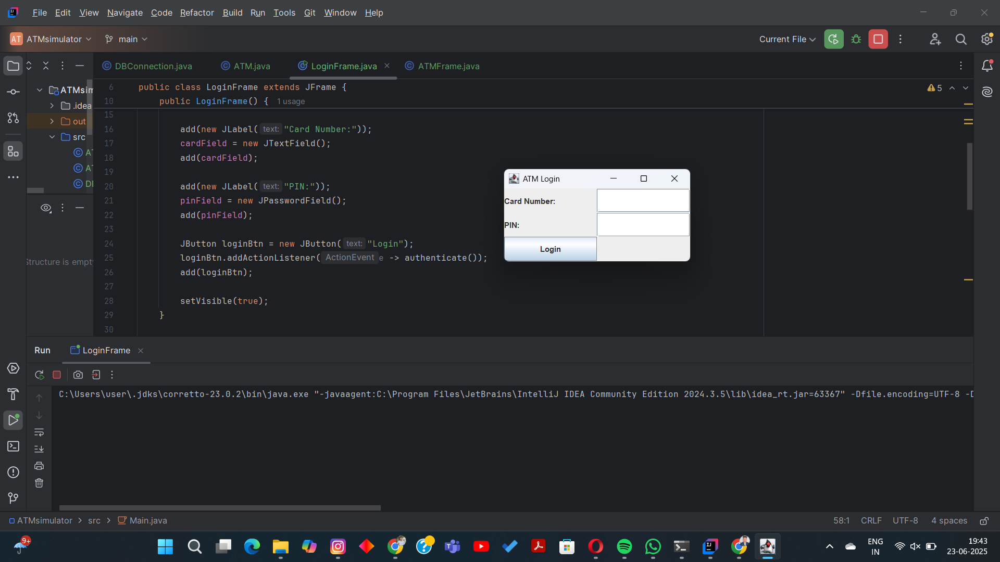
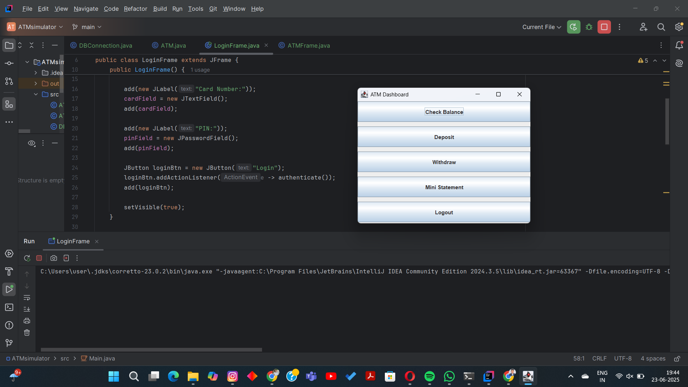

#  Java Swing ATM Simulator

A desktop-based **ATM Simulator** built using **Java Swing + JDBC + MySQL** with a clean multi-class architecture. 

---

##  Project Structure

```
ATM-Simulator-Swing/
├── DBConnection.java       // MySQL connection handler
├── ATM.java                // Core logic: deposit, withdraw, balance
├── LoginFrame.java         // Login screen
├── ATMFrame.java           // Main ATM dashboard
└── README.md               // You're here
```

---

##  Technologies Used

* Java 8+
* Java Swing (GUI)
* JDBC (Java Database Connectivity)
* MySQL
* IntelliJ IDEA (Recommended)

---

## Database Setup (MySQL)

```sql
CREATE DATABASE atm_db;
USE atm_db;

CREATE TABLE users (
  card_number VARCHAR(20) PRIMARY KEY,
  pin VARCHAR(10),
  name VARCHAR(50),
  balance DOUBLE
);

CREATE TABLE transactions (
  id INT AUTO_INCREMENT PRIMARY KEY,
  card_number VARCHAR(20),
  type VARCHAR(10),
  amount DOUBLE,
  timestamp TIMESTAMP DEFAULT CURRENT_TIMESTAMP
);

INSERT INTO users VALUES ('1234567890', '1234', 'Shreya', 5000);
```

---

##  How to Run in IntelliJ IDEA

###  1. Clone or Download Project

```bash
git clone https://github.com/your-username/ATM-Simulator-Swing.git
```

###  2. Open in IntelliJ

* Open IntelliJ
* File > Open > Select the folder

###  . Add MySQL JDBC Driver

* File > Project Structure > Libraries > Add `.jar`
* Choose `mysql-connector-java-<version>.jar`

### ▶ . Run

* Right-click on `LoginFrame.java`
* Click **Run 'LoginFrame.main()'**

---
##  Screenshots

###  Login Page


###  ATM Dashboard


##  Features

*  Secure login using card number + PIN
*  Deposit and withdraw with balance check
   View current balance
*  View last 5 transactions (Mini Statement)
*  Logout option

---

##  Future Scope

* Admin panel to register users
* Export mini statement as PDF
* GUI-based registration page

---


